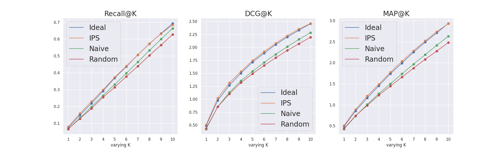
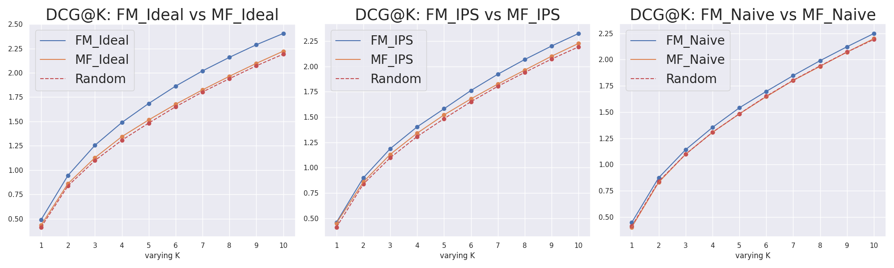
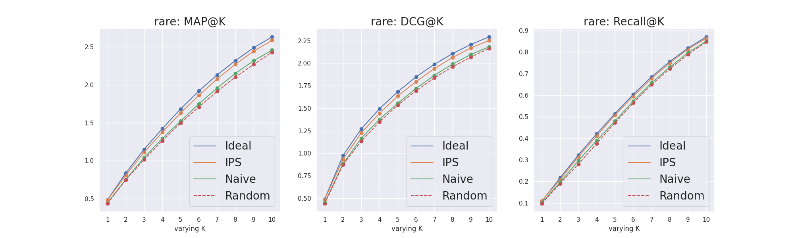
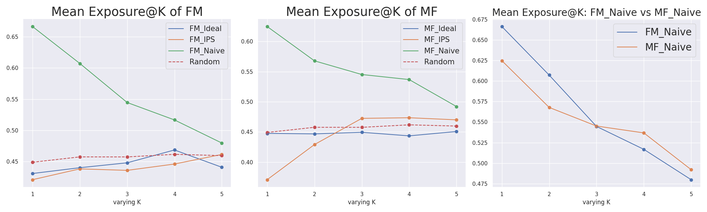
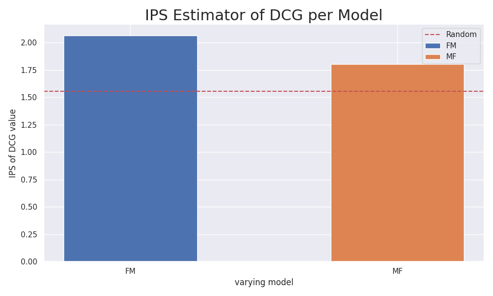

# Unbiased Recommender Learning With Relevance-FactorizationMachines

本リポジトリは、大学院での個人の研究成果を基盤とし、アルゴリズムの性能評価を目的としています。本研究での主な成果は、以下の2点に集約されます。  
1. Factorization Machinesを用いて、露出バイアスを考慮した推薦モデルの構築。
2. 露出バイアスが含まれたログデータを使用し、2種類の不偏推定量の性能を評価。

研究の詳細は<a href="https://github.com/tatsuki1107/Relevance-FactorizationMachine/blob/master/short_paper.md">short_paper.md</a>に記載しております。  
先にこちらをご覧ください。

# 1. 主な使用技術
詳細は、<a href="https://github.com/tatsuki1107/Relevance-FactorizationMachine/blob/master/pyproject.toml">pyproject.toml</a>を参照下さい。
|名称|バージョン|説明|
|:---:|:--------:|:-:|
|Python|3.9|-|
|Docker|20.10.21|コンテナ環境|
|Docker Compose|2.13.0|コンテナ管理|
|Poetry|1.6.1|Pythonパッケージ管理|
|Numpy|1.24.3|行列演算ライブラリ|
|SciPy|1.9.3|科学計算ライブラリ|
|Pandas|2.0.1|表データ管理|
|scikit-learn|1.2.2|機械学習汎用ライブラリ|
|matplotlib|3.7.1|描画ライブラリ|
|seaborn|0.12.2|描画ライブラリ|
|hydra-core|1.3.2|設定管理・アプリケーション構造化|
|pytest|7.4.0|テストライブラリ|

アルゴリズムへの深い理解と実装スキルの向上を目指しているため、コードは主にNumpyとSciPyを使用したオリジナルの実装となっています。

# 2. 使用するデータセット
本研究での実験には、<a href="https://kuairec.com/">KuaiRecデータセット</a>を使用します。使用する背景の詳細は、<a href="https://github.com/tatsuki1107/Relevance-FactorizationMachine/blob/master/short_paper.md">`short_paper.md`</a>の`半合成データを用いた性能実験`の項目を参照してください。

## 2.1 扱うcsvファイルの詳細
実験には以下の5つのcsvファイルを使用します。(*実験スクリプトを実行する際は、これらのファイルを/data/kuairec/ディレクトリに格納する必要があります。)

- `small_matrix.csv`: 実験的に収集された、ユーザー数1411人、動画数3327本のフィードバックデータ。評価値行列の密度は約99.6%
- `big_matrix.csv`: 自然に観測された、ユーザー数7176人、動画数10728本のフィードバックデータ
- `item_categories.csv`: 各動画のカテゴリ情報
- `item_daily_features.csv`: 日毎の動画特徴量
- `user_features.csv`: 匿名化されたユーザー特徴量

# 3. ディレクトリ構成

- `conf`: 実験設定関連
  - <a href="https://github.com/tatsuki1107/Relevance-FactorizationMachine/blob/master/conf/config.py">`config.py`</a>: `config.yaml`の型アノテーションクラス
  - <a href="https://github.com/tatsuki1107/Relevance-FactorizationMachine/blob/master/conf/config.yaml">`config.yaml`</a>: 構造化された実験設定
- `data`: 実験データ管理
  - `best_params`: 各モデル・推定量ごとのチューニングパラメータ (json形式)
  -  `Kuairec`: 実験で使用する<a href="https://kuairec.com/">KuaiRecデータセット</a>格納ディレクトリ。(*csvファイル必須)
- `logs`: 実験結果・ログ
  - `.hydra`: hydraの設定ディレクトリ
  - `reslut`: 実験結果管理
    - `img`: <a href="https://github.com/tatsuki1107/Relevance-FactorizationMachine/blob/master/utils/plot.py">`Visualizer`</a>による画像結果
    - <a href="https://github.com/tatsuki1107/Relevance-FactorizationMachine/blob/master/logs/result/metric.csv">`metric.csv`</a>: 詳細な結果指標
  - <a href="https://github.com/tatsuki1107/Relevance-FactorizationMachine/blob/master/logs/main.log">`main.log`</a>: 実験ログ
- `src`:  推薦アルゴリズム実装
  - <a href="https://github.com/tatsuki1107/Relevance-FactorizationMachine/blob/master/src/base.py">`base.py`</a>: 基底クラスの実装
  - <a href="https://github.com/tatsuki1107/Relevance-FactorizationMachine/blob/master/src/fm.py">`fm.py`</a>: Factorization Machines (FM) の実装
  - <a href="https://github.com/tatsuki1107/Relevance-FactorizationMachine/blob/master/src/mf.py">`mf.py`</a>: Matrix Factorization (MF) の実装
- `test`: ユニットテスト (pytest使用)
  - <a href="https://github.com/tatsuki1107/Relevance-FactorizationMachine/blob/master/test/test_dataloader.py">`test_dataloader.py`</a>: <a href="https://github.com/tatsuki1107/Relevance-FactorizationMachine/blob/master/utils/dataloader/loader.py">`DataLoader`</a>のテスト
  - <a href="https://github.com/tatsuki1107/Relevance-FactorizationMachine/blob/master/test/test_fm.py">`test_fm.py`</a>: <a href="https://github.com/tatsuki1107/Relevance-FactorizationMachine/blob/master/src/fm.py">`FactorizationMachines`</a>のテスト
  - <a href="https://github.com/tatsuki1107/Relevance-FactorizationMachine/blob/master/test/test_mf.py">`test_mf.py`</a>: <a href="https://github.com/tatsuki1107/Relevance-FactorizationMachine/blob/master/src/mf.py">`LogisticMatrixFactorization`</a>のテスト
- `utils`: 汎用的モジュール
  - `dataloader`: データロード関連
    - <a href="https://github.com/tatsuki1107/Relevance-FactorizationMachine/blob/master/utils/dataloader/base.py">`base.py`</a>: 基底クラス
    - <a href="https://github.com/tatsuki1107/Relevance-FactorizationMachine/blob/master/utils/dataloader/loader.py">`loader.py`</a>: 主要なDataLoaderクラス
    - <a href="https://github.com/tatsuki1107/Relevance-FactorizationMachine/blob/master/utils/dataloader/_click.py">`_click.py`</a>: 半人工ログデータ生成
    - <a href="https://github.com/tatsuki1107/Relevance-FactorizationMachine/blob/master/utils/dataloader/_feature.py">`_feature.py`</a>: 特徴量の生成
    - <a href="https://github.com/tatsuki1107/Relevance-FactorizationMachine/blob/master/utils/dataloader/_preperer.py">`_preperer.py`</a>: 学習、評価データの準備
    - <a href="https://github.com/tatsuki1107/Relevance-FactorizationMachine/blob/master/utils/dataloader/_kuairec.py">`_kuairec.py`</a>: KuaiRecデータセットのロード
  - <a href="https://github.com/tatsuki1107/Relevance-FactorizationMachine/blob/master/utils/evaluate.py">`evaluate.py`</a>: 学習済みの機械学習モデルの評価
  - <a href="https://github.com/tatsuki1107/Relevance-FactorizationMachine/blob/master/utils/metrics.py">`metrics.py`</a>: 評価指標の計算
  - <a href="https://github.com/tatsuki1107/Relevance-FactorizationMachine/blob/master/utils/optimizer.py">`optimizer.py`</a>:  最適化アルゴリズム
  - <a href="https://github.com/tatsuki1107/Relevance-FactorizationMachine/blob/master/utils/plot.py">`plot.py`</a>: 実験結果の可視化
  - <a href="https://github.com/tatsuki1107/Relevance-FactorizationMachine/blob/master/utils/search_params.py">`search_params.py`</a>: パラメータのチューニング
- <a href="https://github.com/tatsuki1107/Relevance-FactorizationMachine/blob/master/Dockerfile">`Dockerfile`</a>:Docker Imageの設定
- <a href="https://github.com/tatsuki1107/Relevance-FactorizationMachine/blob/master/README.md">`README.md`</a>: レポジトリの詳細な説明
- <a href="https://github.com/tatsuki1107/Relevance-FactorizationMachine/blob/master/docker-compose.yml">`docker-compose.yml`</a>: コンテナ管理の設定
- <a href="https://github.com/tatsuki1107/Relevance-FactorizationMachine/blob/master/main.py">`main.py`</a>: 実験スクリプトの実行
- <a href="https://github.com/tatsuki1107/Relevance-FactorizationMachine/blob/master/poetry.lock">`poetry.lock`</a>: Pythonパッケージの詳細
- <a href="https://github.com/tatsuki1107/Relevance-FactorizationMachine/blob/master/pyproject.toml">`pyproject.toml`</a>: Pythonパッケージ
- <a href="https://github.com/tatsuki1107/Relevance-FactorizationMachine/blob/master/short_paper.md">`short_paper.md`</a>: 実験の概要・背景・実験設定・結果

# 4. 実験設定の詳細

実験設定についての詳細な解説を提供します。設定は[こちらのconfig.yaml](https://github.com/tatsuki1107/Relevance-FactorizationMachine/blob/master/conf/config.yaml)で確認できます。

## 4.1 実験の再現性

- **`seed`**: 実験の再現性を保証するための乱数のシード値

## 4.2 半人工データセットの生成設定 (`data_logging_settings`)

- **`data_path`**: KuaiRecデータセットの保存先
- **`train_val_test_ratio`**: データセットの訓練、検証、テストへの分割比率
- **`density`**: 評価値行列の密度
- **`behavior_policy`**: ログデータ生成のアルゴリズム。露出バイアスのみを仮定し、ランダムポリシーを使用
- **`exposure_bias`**: 露出バイアスの強度

## 4.3 KuaiRecデータセットのテーブル設定 (`tables`)

### 1. Interactionテーブル

- **`data_path`**: ログデータの保存先
- **`used_features`**: 実験に使用する特徴量のリスト
  - **key**: カラム名
  - **value**: モデルへの入力用データタイプ

### 2. Userテーブル

- **`data_path`**: ユーザー特徴量の保存先
- **`used_features`**: 実験に使用する特徴量のリスト
  - **key**: カラム名
  - **value**: モデルへの入力用データタイプ

### 3. Videoテーブル

#### 3.1 Dailyテーブル

- **`data_path`**: 日別の動画特徴量の保存先
- **`used_features`**: 実験に使用する特徴量のリスト
  - **key**: カラム名
  - **value**: モデルへの入力用データタイプ

#### 3.2 Categoryテーブル

- **`data_path`**: 動画カテゴリー情報の保存先
- **`used_features`**: 実験に使用する特徴量のリスト
  - **key**: カラム名
  - **value**: モデルへの入力用データタイプ

## 4.4 モデルのハイパーパラメータ設定

- **`is_search_params`**: ハイパーパラメータのチューニングを実験前に行うかどうかのフラグ
- **`model_param_range`**: 各モデルのハイパーパラメータの範囲
  - **`MF` (Matrix Factorization)**
    - **`n_epochs`**: 学習のイテレーション数
    - **`n_factors`**: 潜在因子の数
    - **`lr`**: 学習率
    - **`reg`**: 正則化パラメータ
    - **`batch_size`**: バッチサイズ
  - **`FM` (Factorization Machines)**
    - (同様の設定が含まれています)

# 5. セットアップと実験の実行

## 5.1 Docker Desktopのインストール
本実験スクリプトは、Docker環境で動作します。各OSに応じてDocker Desktopをインストールして下さい。

## 5.2 Docker Image のビルド
```
docker compose build
```
## 5.3 実験スクリプトの実行
```
docker compose run unbiased-fm poetry run python main.py is_search_params=False
```
## 5.4 結果の描画
実験スクリプトを実行すると`logs/result/img`ディレクトリにグラフの画像が保存されます。
### 画像1: Factorization Machines (FM) に3つの損失を適用した際のテストデータにおける各ランク指標の性能比較

### 画像2: Factorization Machines (FM)とMatrix Factorization (MF)の3つの損失に対するDCG@K性能比較

### 画像3: ログデータにおけるレアアイテムのランク指標性能。Factorization Machines (FM)を取り入れた各推定量の比較。

### 画像4: カスタム評価指標Mean Exposure(ME)@Kを用いた性能比較

### 画像5: 検証データを用いた各IPS推定量の性能を比較
  


# 付録
この付録は<a href="https://github.com/tatsuki1107/Relevance-FactorizationMachine/blob/master/short_paper.md">short_paper.md</a>の **`実験設定 7.学習`** の詳細を説明するためのものです。  

## Matrix Factorization の詳細

### 予測式
```math
\begin{aligned}
\sigma(x) &= \frac{1}{1 + \exp(-x)}  \\
\hat{R}_{u,i} &= \sigma(\mathbf{q}_i^T\mathbf{p}_u + b_u + b_i + b)  \\
\end{aligned}
```

### 目的関数
$`B \subseteq D`$: エポックごとに生成するバッチデータ  
$`|B|`$: バッチサイズ  

```math
\begin{aligned}
\hat{L}_{IPS}(\hat{R}) &= -\frac{1}{|B|}\sum_{(u,i) \in B}^{|B|}[\frac{Y_{u,i}}{\theta_{u,i}}\log(\hat{R}_{u,i}) + (1 - \frac{Y_{u,i}}{\theta_{u,i}})\log(1 - \hat{R}_{u,i})] + \frac{\lambda}{2} (||\mathbf{p}_u||^2 + ||\mathbf{q}_i||^2 + b_u^2 + b_i^2) \\
\end{aligned}
```
```math
\begin{aligned}
& \underset{\mathbf{p}_u, \mathbf{q}_i, b_u, b_i}{\text{minimize}} & & \hat{L}_{IPS}(\hat{R}) \\
& \text{subject to} & & \lambda \geq 0
\end{aligned}
```
### 勾配
```math
\begin{aligned}
・　\frac{\partial \hat{L}_{IPS}(\hat{R})}{\partial \mathbf{q}_i} &= -\frac{1}{|B|}\sum_{(u,i) \in B}^{|B|}[ (\frac{Y_{u,i}}{\theta_{u,i}} - \hat{R}_{u,i})\mathbf{p}_u] + \lambda \mathbf{q}_i  \\
・　\frac{\partial \hat{L}_{IPS}(\hat{R})}{\partial \mathbf{p}_u} &= -\frac{1}{|B|}\sum_{(u,i) \in B}^{|B|}[ (\frac{Y_{u,i}}{\theta_{u,i}} - \hat{R}_{u,i})\mathbf{q}_i] + \lambda \mathbf{p}_u  \\
・　\frac{\partial \hat{L}_{IPS}(\hat{R})}{\partial b_i} &= -\frac{1}{|B|}\sum_{(u,i) \in B}^{|B|}[\frac{Y_{u,i}}{\theta_{u,i}} - \hat{R}_{u,i}] + \lambda b_i  \\
・　\frac{\partial \hat{L}_{IPS}(\hat{R})}{\partial b_u} &= -\frac{1}{|B|}\sum_{(u,i) \in B}^{|B|}[\frac{Y_{u,i}}{\theta_{u,i}} - \hat{R}_{u,i}] + \lambda b_u  \\
\end{aligned}
```

### 更新式
```math
\begin{aligned}
&・　\mathbf{q}^{new}_{i}  := \mathbf{q}^{old}_{i} - \eta \frac{\partial \hat{L}_{IPS}(\hat{R})}{\partial \mathbf{q}^{old}_i} \\
&・　\mathbf{p}^{new}_{u}  := \mathbf{p}^{old}_{u} - \eta \frac{\partial \hat{L}_{IPS}(\hat{R})}{\partial \mathbf{p}^{old}_u} \\
&・　 b^{new}_{i}  := b^{old}_{i} - \eta \frac{\partial \hat{L}_{IPS}(\hat{R})}{\partial b^{old}_i} \\
&・　 b^{new}_{u}  := b^{old}_{u} - \eta \frac{\partial \hat{L}_{IPS}(\hat{R})}{\partial b^{old}_u} \\
\end{aligned}
```

## Factorization Machines の詳細

### 予測式
$n$: 特徴数  
$t$: レコード位置  
$K$: 因子数  


```math
\begin{aligned}
\hat{y}(\mathbf{x}_t) &= w_0 + \sum_{i=1}^{n}w_{i}x_{t,i}+\sum_{i=1}^{n}\sum_{j=i+1}^{n}<\mathbf{v}_{i},\mathbf{v}_{j}>x_{t,i}x_{t,j}\\
&= w_0 + \sum_{i=1}^{n}w_{i}x_{t,i}+\frac{1}{2} \sum_{f=1}^{K} \left( \left( \sum_{j=1}^{n} v_{j,f}x_{t,j} \right)^2 - \sum_{j=1}^{n} v_{j,f}^2 x_{t,j}^2 \right)\\
\hat{R}_{t} &= \sigma(\hat{y}(\mathbf{x}_t)) \\
\end{aligned}
```

### 目的関数

```math
\hat{L}_{IPS}(\hat{R}) = -\frac{1}{|B|}\sum_{t=1}^{|B|}[\frac{Y_{t}}{\theta_{t}}\log(\hat{R}_{t}) + (1 - \frac{Y_{t}}{\theta_{t}})\log(1 - \hat{R}_{t})] 
```
```math
\begin{aligned}
& \underset{w_0, \mathbf{w}, V}{\text{minimize}} & & \hat{L}_{IPS}(\hat{R})
\end{aligned}
```


### 勾配
```math
\begin{aligned}
\frac{\partial \hat{y}(\mathbf{x}_t)}{\partial w_0} &= 1 \\
・　\frac{\partial \hat{L}_{IPS}(\hat{R})}{\partial w_0} &= -\frac{1}{|B|}\sum_{t=1}^{|B|}\left[(\frac{Y_{t}}{\theta_{t}} - \hat{R}_{t}) \frac{\partial \hat{y}(\mathbf{x}_t)}{\partial w_0} \right]
\end{aligned}
```

```math
\begin{aligned}
\frac{\partial \hat{y}(\mathbf{x}_t)}{\partial \mathbf{w}} &= \mathbf{x}_t \\
・　\frac{\partial \hat{L}_{IPS}(\hat{R})}{\partial \mathbf{w}} &= -\frac{1}{|B|}\sum_{t=1}^{|B|}\left[(\frac{Y_{t}}{\theta_{t}} - \hat{R}_{t}) \frac{\partial \hat{y}(\mathbf{x}_t)}{\partial \mathbf{w}} \right]
\end{aligned}
```

```math
\begin{aligned}
\frac{\partial \hat{y}(\mathbf{x}_t)}{\partial v_{i,f}} &= x_{t,i} \sum_{j=1}^{n} \left[v_{j,f}x_{t,j} \right] - v_{i,f}x_{t,i}^2 \\
・　\frac{\partial \hat{L}_{IPS}(\hat{R})}{\partial v_{i,f}} &= -\frac{1}{|B|}\sum_{t=1}^{|B|}\left[(\frac{Y_{t}}{\theta_{t}} - \hat{R}_{t}) \frac{\partial \hat{y}(\mathbf{x}_t)}{\partial v_{i,f}} \right]
\end{aligned}
```
### 更新式
```math
\begin{aligned}
&・　w_0^{new} := w_0^{old} - \eta \frac{\partial \hat{L}_{IPS}(\hat{R})}{\partial w_0^{old}} \\
&・　\mathbf{w}^{new} := \mathbf{w}^{old} - \eta \frac{\partial \hat{L}_{IPS}(\hat{R})}{\partial \mathbf{w}^{old}} \\
&・　v_{i,f}^{new} := v_{i,f}^{old} - \eta \frac{\partial \hat{L}_{IPS}(\hat{R})}{\partial v_{i,f}^{old}} \\
\end{aligned}
```
