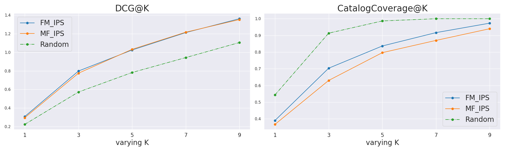

# Unbiased Recommender Learning for Enhanced Relevance and Coverage

This repository contains the experimental code for the journal paper titled [“Unbiased Recommender Learning for Enhanced Relevance and Coverage”](https://link.springer.com/chapter/10.1007/978-3-031-76827-9_13), which was presented as a late-breaking paper at the Human-Computer Interaction 2024 (HCII2024) conference.


# 1. Main Technologies used
See <a href="https://github.com/tatsuki1107/Relevance-FactorizationMachine/blob/master/pyproject.toml">`pyproject.toml`</a> for more details

|Name|Version|Description|
|:---:|:--------:|:-:|
|Python|3.9|-|
|Docker|20.10.21|Container environment|
|Docker Compose|2.13.0|Container environment|
|Poetry|1.6.1|Python package management|
|Numpy|1.24.3|Matrix operations library|
|SciPy|1.9.3|Scientific computing library|
|Pandas|2.0.1|Tabular data management|
|scikit-learn|1.2.2|General-purpose machine learning library|
|matplotlib|3.7.1|Plotting library|
|seaborn|0.12.2|Plotting library|
|hydra-core|1.3.2|Configuration management & application structuring|
|pytest|7.4.0|Testing library|

The code is an original implementation, primarily utilizing NumPy and SciPy, as I aim to enhance my understanding of algorithms and implementation skills.

# 2. Dataset to be used
The <a href="https://kuairec.com/">KuaiRec</a> and <a href="https://www.cs.cornell.edu/~schnabts/mnar/">Coat</a> datasets are used for the experiments in this study.

## 2.1 KuaiRec Dataset Details
The following five CSV files will be used for the experiment. (When running the experiment script, these files must be stored in the `/data/kuairec/` directory)

- `small_matrix.csv`: Feedback data was collected experimentally from 1,411 users and 3,327 videos. The density of the evaluation value matrix is approximately 99.6%.
- `big_matrix.csv`: Feedback data from 7,176 users and 10,728 videos was observed organically.
- `item_categories.csv`: Category information for each video.
- `item_daily_features.csv`: Number of video features per day.
- `user_features.csv`: Anonymized User Features.

## 2.2 Coat Dataset Details
The following five ascii files and two txt files will be used for the experiment. (When running the experiment script, these files must be stored in the `/data/coat/` directory)

- `train.ascii`: Feedback data was collected from 290 users and 300 items. User selection bias is present.
- `test.ascii`: Feedback data was collected from 290 users and 300 items. Representative of a randomly selected true distribution.
- `propensities.ascii`: Pre-estimated user propensity score for selecting items
- `user_item_features/user_features.ascii`: User Features
- `user_item_features/user_features_map.txt`: Names of user features
- `user_item_features/item_features.ascii`: Item Features
- `user_item_features/item_features_map.txt`: Names of item features

# 3. Directory Structure

- <a href="https://github.com/tatsuki1107/Relevance-FactorizationMachine/blob/master/conf/">`conf`</a>: Related to Experimental Setup
- <a href="https://github.com/tatsuki1107/Relevance-FactorizationMachine/blob/master/data/">`data`</a>: Experimental Data Management
- <a href="https://github.com/tatsuki1107/Relevance-FactorizationMachine/blob/master/logs/">`logs`</a>: Experiment Results and Logs
- <a href="https://github.com/tatsuki1107/Relevance-FactorizationMachine/blob/master/src/">`src`</a>:  Recommendation Algorithms
- <a href="https://github.com/tatsuki1107/Relevance-FactorizationMachine/blob/master/utils/">`utils`</a>: Generic Modules
- <a href="https://github.com/tatsuki1107/Relevance-FactorizationMachine/blob/master/Dockerfile">`Dockerfile`</a>:Docker Image Settings
- <a href="https://github.com/tatsuki1107/Relevance-FactorizationMachine/blob/master/README.md">`README.md`</a>: Detailed Repository Description
- <a href="https://github.com/tatsuki1107/Relevance-FactorizationMachine/blob/master/docker-compose.yml">`docker-compose.yml`</a>: Container Management Settings
- <a href="https://github.com/tatsuki1107/Relevance-FactorizationMachine/blob/master/main_coat.py">`main_coat.py`</a>: Running experimental scripts using the Coat dataset
- <a href="https://github.com/tatsuki1107/Relevance-FactorizationMachine/blob/master/main_kuairec.py">`main_kuairec.py`</a>: Running experimental scripts using the Kuairec dataset
- <a href="https://github.com/tatsuki1107/Relevance-FactorizationMachine/blob/master/poetry.lock">`poetry.lock`</a>: Details of the Python package
- <a href="https://github.com/tatsuki1107/Relevance-FactorizationMachine/blob/master/pyproject.toml">`pyproject.toml`</a>: Python package

# 4. Setting up and running the experiment

## 4.1 Installation of Docker Desktop
This experimental script runs in a Docker environment. Please install Docker Desktop according to your operating system.

## 4.2 Build a Docker Image
```
docker compose build
```
## 4.3 Running the experiment

### Kuairec dataset
```
docker compose run unbiased-fm poetry run python main_kuairec.py setting=kuairec
```
### Coat dataset
```
docker compose run unbiased-fm poetry run python main_coat.py setting=coat
```

## 4.4 Drawing Results
- Comparing the performance of DCG@K and CatalogCoverage@K when applying Matrix Factorization (MF) and Factorization Machines (FM) to IPS estimators


<div align="center"><b>Figure 1: Evaluation metrics on the Kuairec dataset</b></div>  



<div align="center"><b>Figure 2: Evaluation metrics on the Coat dataset</b></div>  


- Drawing of a custom evaluation index Mean Exposure (ME) @K. A constant value at a given recommendation position indicates that the recommendation is independent of the frequency of exposure (popularity) of the item.


<div align="center"><b>Figure 3: Mean Exposure @ K on the Kuairec dataset</b></div>


<div align="center"><b>Figure 4: Mean Exposure @ K on the Coat dataset</b></div>


# appendix
In this section, we derive the objective function and the slope of the Matrix Factorization (MF) and Factorization Machines (FM) when applied to the IPS estimator.

## Matrix Factorization (MF)

```math
\begin{aligned}
\sigma(x) &= \frac{1}{1 + \exp(-x)}  \\
\hat{R}_{u,i} &= \sigma(\mathbf{q}_i^T\mathbf{p}_u + b_u + b_i + b)  \\
\end{aligned}
```

### Objective Function
$`B \subseteq D`$: Batch data generated per epoch  
$`|B|`$: Size of batch data  
$`p \in [0, 1]`$: Parameters controlling the trade-off between variance and bias of the IPS estimator

```math
\begin{aligned}
\hat{L}_{IPS}(\hat{R}) &= -\frac{1}{|B|}\sum_{(u,i) \in B}^{|B|}[\frac{Y_{u,i}}{\theta_{u,i}^p}\log(\hat{R}_{u,i}) + (1 - \frac{Y_{u,i}}{\theta_{u,i}^p})\log(1 - \hat{R}_{u,i})] + \frac{\lambda}{2} (||\mathbf{p}_u||^2 + ||\mathbf{q}_i||^2 + b_u^2 + b_i^2) \\
\end{aligned}
```
```math
\begin{aligned}
& \underset{\mathbf{p}_u, \mathbf{q}_i, b_u, b_i}{\text{minimize}} & & \hat{L}_{IPS}(\hat{R}) \\
& \text{subject to} & & \lambda \geq 0
\end{aligned}
```
### Gradient of the objective function
```math
\begin{aligned}
・　\frac{\partial \hat{L}_{IPS}(\hat{R})}{\partial \mathbf{q}_i} &= -\frac{1}{|B|}\sum_{(u,i) \in B}^{|B|}[ (\frac{Y_{u,i}}{\theta_{u,i}^p} - \hat{R}_{u,i})\mathbf{p}_u] + \lambda \mathbf{q}_i  \\
・　\frac{\partial \hat{L}_{IPS}(\hat{R})}{\partial \mathbf{p}_u} &= -\frac{1}{|B|}\sum_{(u,i) \in B}^{|B|}[ (\frac{Y_{u,i}}{\theta_{u,i}^p} - \hat{R}_{u,i})\mathbf{q}_i] + \lambda \mathbf{p}_u  \\
・　\frac{\partial \hat{L}_{IPS}(\hat{R})}{\partial b_i} &= -\frac{1}{|B|}\sum_{(u,i) \in B}^{|B|}[\frac{Y_{u,i}}{\theta_{u,i}^p} - \hat{R}_{u,i}] + \lambda b_i  \\
・　\frac{\partial \hat{L}_{IPS}(\hat{R})}{\partial b_u} &= -\frac{1}{|B|}\sum_{(u,i) \in B}^{|B|}[\frac{Y_{u,i}}{\theta_{u,i}^p} - \hat{R}_{u,i}] + \lambda b_u  \\
\end{aligned}
```

### Parameter Update
```math
\begin{aligned}
&・　\mathbf{q}^{new}_{i}  := \mathbf{q}^{old}_{i} - \eta \frac{\partial \hat{L}_{IPS}(\hat{R})}{\partial \mathbf{q}^{old}_i} \\
&・　\mathbf{p}^{new}_{u}  := \mathbf{p}^{old}_{u} - \eta \frac{\partial \hat{L}_{IPS}(\hat{R})}{\partial \mathbf{p}^{old}_u} \\
&・　 b^{new}_{i}  := b^{old}_{i} - \eta \frac{\partial \hat{L}_{IPS}(\hat{R})}{\partial b^{old}_i} \\
&・　 b^{new}_{u}  := b^{old}_{u} - \eta \frac{\partial \hat{L}_{IPS}(\hat{R})}{\partial b^{old}_u} \\
\end{aligned}
```

## Factorization Machines (FM)

$n$: Number of features  
$t$: Record number  
$K$: Number of factors 


```math
\begin{aligned}
\hat{y}(\mathbf{x}_t) &= w_0 + \sum_{i=1}^{n}w_{i}x_{t,i}+\sum_{i=1}^{n}\sum_{j=i+1}^{n}<\mathbf{v}_{i},\mathbf{v}_{j}>x_{t,i}x_{t,j}\\
&= w_0 + \sum_{i=1}^{n}w_{i}x_{t,i}+\frac{1}{2} \sum_{f=1}^{K} \left( \left( \sum_{j=1}^{n} v_{j,f}x_{t,j} \right)^2 - \sum_{j=1}^{n} v_{j,f}^2 x_{t,j}^2 \right)\\
\hat{R}_{t} &= \sigma(\hat{y}(\mathbf{x}_t)) \\
\end{aligned}
```

### Objective Function

```math
\hat{L}_{IPS}(\hat{R}) = -\frac{1}{|B|}\sum_{t=1}^{|B|}[\frac{Y_{t}}{\theta_{t}^p}\log(\hat{R}_{t}) + (1 - \frac{Y_{t}}{\theta_{t}^p})\log(1 - \hat{R}_{t})] 
```
```math
\begin{aligned}
& \underset{w_0, \mathbf{w}, V}{\text{minimize}} & & \hat{L}_{IPS}(\hat{R})
\end{aligned}
```


### Gradient of the objective function
```math
\begin{aligned}
\frac{\partial \hat{y}(\mathbf{x}_t)}{\partial w_0} &= 1 \\
・　\frac{\partial \hat{L}_{IPS}(\hat{R})}{\partial w_0} &= -\frac{1}{|B|}\sum_{t=1}^{|B|}\left[(\frac{Y_{t}}{\theta_{t}^p} - \hat{R}_{t}) \frac{\partial \hat{y}(\mathbf{x}_t)}{\partial w_0} \right]
\end{aligned}
```

```math
\begin{aligned}
\frac{\partial \hat{y}(\mathbf{x}_t)}{\partial \mathbf{w}} &= \mathbf{x}_t \\
・　\frac{\partial \hat{L}_{IPS}(\hat{R})}{\partial \mathbf{w}} &= -\frac{1}{|B|}\sum_{t=1}^{|B|}\left[(\frac{Y_{t}}{\theta_{t}^p} - \hat{R}_{t}) \frac{\partial \hat{y}(\mathbf{x}_t)}{\partial \mathbf{w}} \right]
\end{aligned}
```

```math
\begin{aligned}
\frac{\partial \hat{y}(\mathbf{x}_t)}{\partial v_{i,f}} &= x_{t,i} \sum_{j=1}^{n} \left[v_{j,f}x_{t,j} \right] - v_{i,f}x_{t,i}^2 \\
・　\frac{\partial \hat{L}_{IPS}(\hat{R})}{\partial v_{i,f}} &= -\frac{1}{|B|}\sum_{t=1}^{|B|}\left[(\frac{Y_{t}}{\theta_{t}^p} - \hat{R}_{t}) \frac{\partial \hat{y}(\mathbf{x}_t)}{\partial v_{i,f}} \right]
\end{aligned}
```
### Parameter Update
```math
\begin{aligned}
&・　w_0^{new} := w_0^{old} - \eta \frac{\partial \hat{L}_{IPS}(\hat{R})}{\partial w_0^{old}} \\
&・　\mathbf{w}^{new} := \mathbf{w}^{old} - \eta \frac{\partial \hat{L}_{IPS}(\hat{R})}{\partial \mathbf{w}^{old}} \\
&・　v_{i,f}^{new} := v_{i,f}^{old} - \eta \frac{\partial \hat{L}_{IPS}(\hat{R})}{\partial v_{i,f}^{old}} \\
\end{aligned}
```
