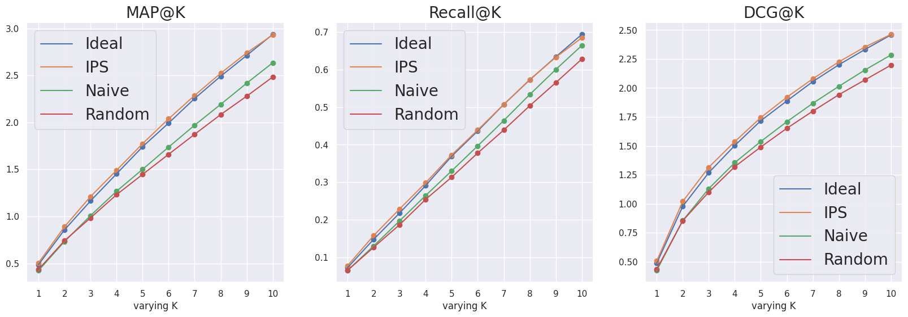
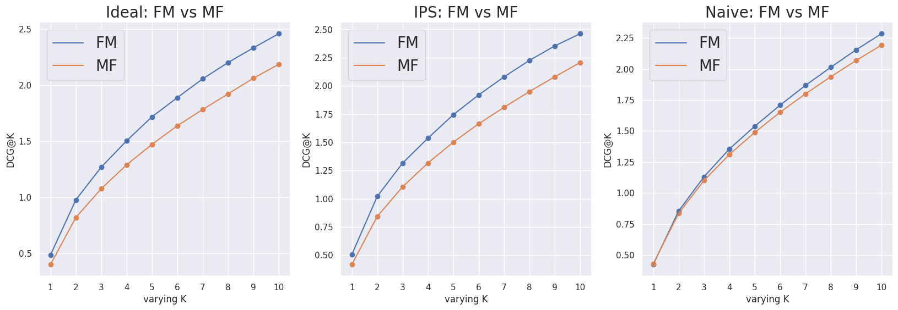
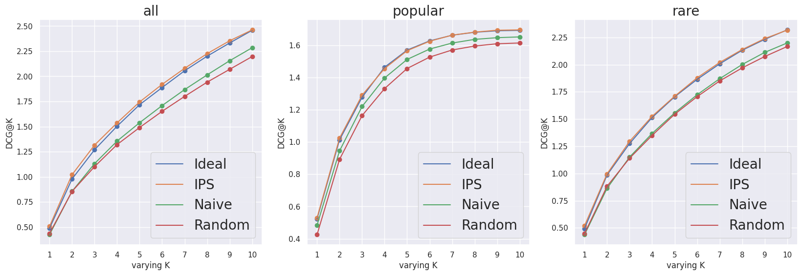

# Relevance Factorization Machine
更新日時: 2023/10/03 (火)

# 概要  
　本研究では、露出バイアスのかかったクリックデータ（暗黙的フィードバック）を元に、ユーザーが好むアイテムを推薦する手法を提案する。露出バイアスの対応は、以下の２つの課題の解決と同義である。第一の課題は、Missing Not At Random 問題で、露出度合いの差によってクリックの欠損がランダムでないことを指す。第二の課題は、Positive Unlabeled問題で、未クリックデータが必ずしもNegativeとは言えない問題を指す。例えば、ユーザーがアイテムを好まなかったのか、単にアイテムを見ていないのかの区別がつかない。  
　これらの課題を解決する手法として、[1]では理想的な目的関数を定義し、観測データのみを用いてこの目的関数を近似する不偏推定量を導入し、関連度の最大化に成功している。しかしこの手法、Rel-MFには欠点が存在する。具体的には、不確実なクリックデータのみを学習に活用するため、識別能力が不足している。結果として、理想的な目的関数の近似、すなわちIPS推定量とNaive推定量の間で性能に大きな違いが見られない。これを克服するため、特徴量を活用可能なFactorization Machineを推薦アルゴリズムとして採用する。そして、異なるアルゴリズムを採用しても、推定量の性質が不変であることを示す。モデルの識別能力を向上させることで、理想的な性能が向上し、この性能を近似するIPS推定量の性能上限も同様に向上することを実証する。


# 導入
近年、推薦システムにおけるバイアスの問題が急浮上してきた[2]。このバイアスは、フィードバックループを通じて収集されるデータに多種多様に潜んでいる。例として、過去の推薦方策やアイテムの露出頻度、さらにはアイテムの表示位置といった要因によって生じるバイアスが考えられる。これらのバイアスを見過ごすと、ユーザ間の均質化やアイテム間の格差の増大など[3]、多くの課題が生じる可能性がある。そのため、推薦システムを持続的に効果的に運用するためには、これらのバイアス問題の取り組みは避けられない。

# 表記と問題の定式化
## 表記
$`u \in U`$: ユーザーの集合  
$`|U| = m`$: ユーザー数  
$`i \in I`$: アイテムの集合  
$`|I| = n`$: アイテム数  
$`D = U \cdot I`$: すべてのユーザーとアイテムのペアの集合  
$`Y \in \{0,1\}^{m \cdot n}`$: クリック行列  
$`R \in \{0,1\}^{m \cdot n}`$: 関連度行列  
$`O \in \{0,1\}^{m \cdot n}`$: 露出行列  

本研究では、Implicitなクリックデータのみを観測できると仮定する。したがって、ユーザー $u$ がアイテム $i$ をクリックした場合、 $Y_{u,i} = 1$ となり、クリックしなかった場合は $Y_{u,i} = 0$ となる。クリック発生のメカニズムは以下の式で表される。  

$$
\begin{aligned}
Y_{u,i} &= R_{u,i}\cdot O_{u,i} \qquad (1) \\
P(Y_{u,i} = 1) &= P(R_{u,i} = 1)\cdot P(O_{u,i} = 1) \\
&= \gamma_{u,i} \cdot \theta_{u,i} \qquad (2)
\end{aligned}
$$

Position Based Model[4]に従えば、クリックの発生は関連度と露出の積によってモデル化される。このモデルに基づくと、ユーザー $u$ がアイテム $i$ を好むと同時に認知している場合、クリックが発生する。このようにクリック発生メカニズムを仮定することで、露出バイアスを考慮した推定量の導出が可能となる。

## 定式化
最終的な目的は、サービス内のログデータを基に、ユーザーに好みのアイテムを推薦することである。しかし、手元にあるのはクリックデータのようなImplicitフィードバックのみであり、そのようなデータには露出バイアス $O_{u,i}$ も影響している。安易にクリックデータを教師データとして利用すると、アイテム間の格差の拡大など[3]の問題が生じる可能性がある。したがって、嗜好度 $R_{u,i}$ を基に学習することで、より良い推薦が期待できる。しかしそのような明示的なフィードバックは手元にはないため、この嗜好度 $R_{u,i}$ を基にした損失関数が、理想的には解きたい問題となる。  

```math
L_{Ideal}(\hat{R}_{u,i})　　= -\frac{1}{|D|}\sum_{(u,i) \in D} [\gamma_{u,i} \log(\hat{R}_{u,i}) + (1 - \gamma_{u,i})\log(1 - \hat{R}_{u,i})] 
```
このpointwise損失を最小化するような $`\hat{R}_{u,i}`$ を求めるための機械学習アルゴリズムを適用したい。しかし、嗜好度$`\gamma_{u,i}`$は観測できないため、クリックデータ$`Y_{u,i}`$を代わりに利用して損失関数を定義する必要がある。そこで、クリックデータ $`Y_{u,i}`$ を $`\gamma_{u,i}`$ の代わりに用いた損失を以下のように定式化する。  

```math
\hat{L}_{Naive}(\hat{R}_{u,i}) = -\frac{1}{|D|}\sum_{(u,i) \in D}[Y_{u,i}\log(\hat{R}_{u,i}) + (1 - Y_{u,i})\log(1 - \hat{R}_{u,i})]
```

この損失は本当に適切なのでしょうか。この損失は $`L_{Ideal}`$ の推定量と言える。なぜなら、本来求めたい $`\gamma_{u,i}`$ の代わりにクリック変数 $`Y_{u,i}`$ を用いているからである。この推定量の期待値を計算し、その評価を行う。  

```math
\begin{aligned}
\mathbb{E}_{Y}[\hat{L}_{Naive}(\hat{R}_{u,i})] &=  \mathbb{E}_{Y}[-\frac{1}{|D|}\sum_{(u,i) \in D}[Y_{u,i}\log(\hat{R}_{u,i}) + (1 - Y_{u,i})\log(1 - \hat{R}_{u,i})]] \\
&= -\frac{1}{|D|}\sum_{(u,i) \in D}[\mathbb{E}_{Y}[Y_{u,i}]\log(\hat{R}_{u,i}) + (1 - \mathbb{E}_{Y}[Y_{u,i}])\log(1 - \hat{R}_{u,i})] \\
&= -\frac{1}{|D|}\sum_{(u,i) \in D}[\gamma_{u,i}\theta_{u,i}\log(\hat{R}_{u,i}) + (1 - \gamma_{u,i}\theta_{u,i})\log(1 - \hat{R}_{u,i})]
\end{aligned}
```

$`Y_{u,i}`$はクリック変数でベルヌーイ分布に従うので、先程示したように、  

```math
\begin{aligned}
\mathbb{E}_{Y}[Y_{u,i}] &= P(Y_{u,i} = 1) \\
&= \gamma_{u,i} \cdot \theta_{u,i}
\end{aligned}
```
となる。そしてこの推定量の意味するところは、 $`L_{Ideal}`$ に対してバイアスを持つということである。すなわち、  

```math
\mathbb{E}_{Y}[\hat{L}_{Naive}(\hat{R}_{u,i})] \neq L_{Ideal}(\hat{R}_{u,i})
```
となる。もし $`\theta_{u,i}`$ がどのユーザー $`u`$ とアイテム $`i`$ のペアに対しても1であれば、不偏推定量となる。しかし、例えば、画面の下部になるほど露出確率 $`P(O_{u,i} = 1)`$ は低くなると考えられる。従って、 $`\hat{L}_{Naive}`$ は露出確率 $`\theta_{u,i}`$ が高いデータを過度に重視する傾向にある。その結果、画面の下部でのデータはほとんど学習されないため、ユーザー $`u`$ がアイテム $`i`$ を好んでいる可能性があるにも関わらず、クリックが発生しなかったデータを見落としてしまう可能性が高まる。このようなバイアスを考慮した新しい損失関数を以下に示す。

```math
\hat{L}_{IPS}(\hat{R}_{u,i}) = -\frac{1}{|D|}\sum_{(u,i) \in D}[\frac{Y_{u,i}}{\theta_{u,i}}\log(\hat{R}_{u,i}) + (1 - \frac{Y_{u,i}}{\theta_{u,i}})\log(1 - \hat{R}_{u,i})]
```

IPSは、Inversed Propensity Scoreの略で、因果推論の文脈で頻繁に用いられる。因果推論の技術を応用して、[1]で初めて提案されたものは、pointwise損失の不偏推定量としての $`\hat{L}_{IPS}`$ である。この $`\hat{L}_{IPS}`$ の期待値を計算すると以下のようになる。

```math
\begin{aligned}
\mathbb{E}_{Y}[\hat{L}_{IPS}(\hat{R}_{u,i})] &= -\frac{1}{|D|}\sum_{(u,i) \in D}[\frac{Y_{u,i}}{\theta_{u,i}}\log(\hat{R}_{u,i}) + (1 - \frac{Y_{u,i}}{\theta_{u,i}})\log(1 - \hat{R}_{u,i})] \\
&= -\frac{1}{|D|}\sum_{(u,i) \in D}[\frac{\mathbb{E}_{Y}[Y_{u,i}]}{\theta_{u,i}}\log(\hat{R}_{u,i}) + (1 - \frac{\mathbb{E}_{Y}[Y_{u,i}]}{\theta_{u,i}})\log(1 - \hat{R}_{u,i})] \\
&= -\frac{1}{|D|}\sum_{(u,i) \in D}[\gamma_{u,i}\log(\hat{R}_{u,i}) + (1 - \gamma_{u,i})\log(1 - \hat{R}_{u,i})] \\
&= L_{Ideal}({\hat{R}}_{u,i})
\end{aligned} 
```

IPS推定量の期待値が$`L_{Ideal}`$と等しいことから、この推定量が不偏であることが確認された。[1]の研究によれば、IPS推定量は$`L_{Ideal}`$の性能を近似できることが示され、Naive推定量と比較しても優れた性能を発揮することが確認された。これらの推定量の性質については、[1],[5]にて詳しく解説されている。

# 既存研究の問題点
[1]における性能実験では、機械学習モデル$`\hat{R}_{u,i}`$としてLogistic Matrix Factorizationが採用された。

```math
\begin{aligned}
\hat{R}_{u,i} &= \sigma(\mathbf{q}_i^T\mathbf{p}_u + \mathbf{b}_u + \mathbf{b}_i + b) \\
\sigma(x) &= \frac{1}{1 + \exp(-x)}
\end{aligned}
```

Matrix Factorizationは行列分解手法としてスケーラブルで高性能であるため、ベースラインとして広く採用されている[6]。しかしながら、嗜好度合い$`R_{u,i}`$が確率モデルとなる場合、データの不確実性が増す。評価データやクリックデータだけでの予測には限界があると言える。その結果、IPS推定量とNaive推定量の性能の間に大きな差異が生まれず、ビジネス上のインパクトも低いと考えられる。この背景から、$`L_{Ideal}`$の性能が不十分であると考えられ、それを近似したIPS推定量も結果としてNaive推定量と同程度の性能になると推測される。解決策としては、以下の２つが考えられる。  
1. 真の関連度合い$`\gamma_{u,i}`$が観測できる理想的なデータ環境でのモデル性能を向上させる。  
2. 観測データのみを用いてその性能を近似したIPS推定量を開発する。  

この2つを達成することで、pointwise損失におけるIPS推定量が実用的に役立つものとなる。

そこで私は、$`\hat{R}_{u,i}`$にFactorization Machines [7]を用いることでこの課題を解決する。
```math
\begin{aligned}
\hat{y}(\mathbf{x}) &= w_0 + \sum_{i=1}^{n}w_ix_i+\sum_{i=1}^{n}\sum_{j=i+1}^{n}<\mathbf{v}_{i},\mathbf{v}_{j}>x_ix_j\\
\hat{R}_{u,i} &= \sigma(\hat{y}(\mathbf{x}))
\end{aligned} 
```

このアルゴリズムは、情報推薦の文脈ではMatrix Factorizationの派生形として知られており、モデルベースの協調フィルタリングの一つである。ユーザーとアイテムの協調性に加え、補助情報としての特徴量も扱えるため、Logistic MFよりも高い性能が期待される。


## IPS推定量はモデルの選択に独立して不偏推定量となる
IPS推定量は観測データのみを用いて$`L_{Ideal}`$を統計的に近似する方法である。具体的には、クリック変数$`Y_{u,i}`$の期待値を取得した際に$`L_{Ideal}`$と同等となるように、事前に$`\theta_{u,i}`$を重み付けすることを内部で行う。これは機械学習モデル$`\hat{R}_{u,i}`$の選択に関わらず、あらゆるパラメトリックモデルに適用可能であることを示している。従って、より高性能なDNNベースのアルゴリズムを採用することで、更に精度の高い推薦が可能となる。


## 高性能なアルゴリズムを取り入れる際の注意点
バイアスのかかった観測データを使用すると、$`\hat{L}_{Naive}`$に高度なモデルを組み込む際の問題が浮き彫りとなる。特に、露出確率$`P(O_{u,i} = 1)`$が高いデータに対する予測精度が増加することで、既存のバイアスが一層強まる可能性がある。一部の研究[8]では、オフライン評価とオンライン評価の間に相関が見られないという結果が示されている。単純にアルゴリズムの精度を追求するだけでなく、実際の環境でのバイアスの影響も考慮する必要がある。そうしないと、機械学習の導入によるビジネス価値が減少してしまう恐れがある。この背景を踏まえ、実際の環境とのギャップを考慮した不偏推定量を用いたモデルの性能評価が求められる。本研究では、Factorization MachineとMatrix Factorizationの2つのモデルを用いて、IPS推定量の基準での性能評価を行い、実環境での性能差を検証する。


# 半合成データを用いた性能実験
本節では半合成データを用いて以下のリサーチクエスチョンを検討する。  
* RQ1: FMを使用することにより、$`L_{Ideal}`$の性能は向上し、その結果、$`\hat{L}_{IPS}`$推定量の性能も改善し、実際の応用に適しているのか？
* RQ2: FMの採用によって全体的な性能が向上する場合、$`\hat{L}_{Naive}`$が最適化できない低露出確率のアイテムの推薦も正確に行われているのか？
* RQ3: バイアスがかかった検証データを使用して、モデル間の性能を評価することは可能か？  

## データセット
本実験においては、KuaiRecデータセット[9]を基に性能実験を行う。このデータセットは、中国の動画プラットフォームである快手(kuaishou)における動画のフィードバックデータを含んでいる。KuaiRecデータセットを選択した背景として以下の理由が挙げられる。

1. 「small_matrix.csv」には、ユーザー1411人とアイテム3327個のフィードバックデータがほぼ100%含まれている。これにより、このフィードバックを真の嗜好度合い$`\gamma_{u,i}`$と見なして実験することができる。
2. データセットには、豊富なユーザーとアイテムの特徴量が含まれている。「user_features.csv」には匿名化されたユーザー特徴、「item_category.csv」および「item_daily_features.csv」にはアイテムの特徴量が記載されており、これらの情報はFactorization Machineの実装に非常に役立つ。

これらの特徴から、Learning to Rankの研究を反実仮想的な状況を仮定して進めるには、KuaiRecデータセットが適していると判断した。


## 実験設定

### 1. ログデータの生成
「small_matrix.csv」から人工的なログデータを生成する。このデータの評価値行列の値は実験的に集められたため、密度はほぼ100%となっている。本実験では、ログデータのバイアスは露出格差によるものだけであると仮定し、ランダム推薦を行って評価値行列の5%のデータでログデータ$`D`$を生成する。


### 2. 真の嗜好度合い$`\gamma_{u,i}`$の生成
「small_matrix.csv」には「watch_ratio」カラムが存在しており、これは動画の視聴時間と動画の全体の長さの比率を示している。watch_ratioが高い場合、ユーザー$`u`$が動画$`i`$を好んでいると解釈できる。値が2以上の場合は$`\gamma_{u,i}`$の最大値として1とし、それ以下の場合はそのままの値として取り扱う。これにより、$`\gamma_{u,i} \in [0,1]`$の範囲内に収めるためのスケーリングを行う。


### 3. 露出確率$`\theta_{u,i}`$の生成
「big_matrix.csv」には実サービスで収集されたフィードバックデータが含まれており、過去の推薦方策や露出の度合いなど様々なバイアスが含まれていると推測される。このデータを利用して、「small_matrix.csv」に含まれるアイテムの観測回数を基に露出のバイアスを人工的に作成する。その後、この観測回数を標準化し、シグモイド関数を適用して$`\theta_{u,i} \in [0,1]`$の範囲内に収める。

### 4. クリック変数$`Y_{u,i}`$の生成
Position Based Modelを基にクリックデータを生成する。具体的には、次の式に従う。
```math
O_{u,i} \sim Bern(\theta_{u,i}), \quad R_{u,i} \sim Bern(\gamma_{u,i}), \quad
Y_{u,i} = O_{u,i} \cdot R_{u,i}, \quad \forall (u,i) \in D
```

### 5. 特徴量の作成
ログデータ$`D`$から、ユーザー$`u`$とアイテム$`i`$の特徴量を抽出する。

* Matrix Factorizationでは、特徴量としてユーザー$`u`$とアイテム$`i`$のインデックスのみを使用する。このため、「user_id」カラムと「video_id」カラムを用いてインデックスを生成する。

* Factorization Machineにて使用する特徴量は、user_features.csv、item_category.csv、およびitem_daily_features.csvから選択した。この実験では、特徴量の詳細なエンジニアリングには焦点を当てていない。というのも、本研究の興味は、バイアスが含まれるログデータを使用した各モデル間の性能にあり、特にMFの性能向上のための特徴量を選定する。ただし、関数への入力のために、標準化とワンホットエンコードは施す。使用した特徴量の詳細は、conf/config.yamlに記載している。特徴量の最適化や説明可能性を考慮した研究も、将来的には重要となるであろう。


### 6. データの分割と学習の準備
ログデータ$`D`$はホールド・アウト法を使用し、学習、検証、およびテストデータに分割する。分割の比率は8:1:1とした。テストデータは実環境の性能を模倣する目的で用意しており、教師データとして$`R_{u,i}`$を使用する。これは、A/Bテストから得られるオンライン指標（例：CTR）の代替としての役割を果たす。さらに、2つのモデル（MF, FM）を3つの損失$`L_{Ideal}`$, $`\hat{L}_{IPS}`$, $`\hat{L}_{Naive}`$に組み込み、学習を行う。

以下の表は、使用するデータと損失の組み合わせを示している。


| 損失関数\教師データ |              学習              |              検証              | テスト(実環境) |
| :-----------------: | :----------------------------: | :----------------------------: | :------------: |
|     $`L_{Ideal}`$     |         $`\gamma_{u,i}`$         |           $`R_{u,i}`$            |   $`R_{u,i}`$    |
|   $`\hat{L}_{IPS}`$   | $`\frac{Y_{u,i}}{\theta_{u,i}}`$ | $`\frac{Y_{u,i}}{\theta_{u,i}}`$ |   $`R_{u,i}`$    |
|  $`\hat{L}_{Naive}`$  |           $`Y_{u,i}`$            |           $`Y_{u,i}`$            |   $`R_{u,i}`$    |

### チューニング
３つの推定量と2つのモデルが存在するため、データの探索空間は異なる。各組み合わせを公平に評価するため、6パターンのモデルチューニングを実施する。パラメータの選定に関しては、初期の段階で手動で大まかな候補を選び、その後ランダムサーチを利用する。

ランキングの精度を重視して、DCG@3をメトリックとして採用する。しかしながら、$`L_{Ideal}`$, $`\hat{L}_{IPS}`$, および $`\hat{L}_{Naive}`$ はそれぞれ異なる検証データを扱うため、使用するチューニングデータも変わる。特に検証データはPosition Based Modelに基づくクリックデータであり、バイアスが考慮された上で$`\hat{L}_{IPS}`$のチューニングが必要である。以下の表は、各推定量におけるチューニング式を示している。
 

| 損失              | チューニングするDCG@3                                                                                                                                                                                                                                 |
| ----------------- | ----------------------------------------------------------------------------------------------------------------------------------------------------------------------------------------------------------------------------------------------------- |
| $`L_{Ideal}`$       | $`\hat{R}_{Ideal}(\hat{Z}_{u,i})=\frac{1}{\|U\|}\sum_{u \in U} \sum_{i \in I^{val}_u:R_{u,i}=1} \frac{\mathbb{I}\{\hat{Z}_{u,i} \leq K\}}{\log(\hat{Z}_{u,i}+1)}`$                                                                                      |
| $`\hat{L}_{IPS}`$   | $`\hat{R}_{SNIPS}(\hat{Z}_{u,i}) = \frac{1}{\|U\|}\sum_{u \in U}\frac{1}{\sum_{i \in I^{val}_u} \frac{Y_{u,i}}{\theta_{u,i}}}\sum_{i \in I^{val}_u}\frac{Y_{u,i}}{\theta_{u,i}}\cdot \frac{\mathbb{I}\{\hat{Z}_{u,i} \leq K\}}{\log(\hat{Z}_{u,i}+1)}`$ |
| $`\hat{L}_{Naive}`$ | $`\hat{R}_{Naive}(\hat{Z}_{u,i})=\frac{1}{\|U\|}\sum_{u \in U} \sum_{i \in I^{val}_u:Y_{u,i}=1} \frac{\mathbb{I}\{\hat{Z}_{u,i} \leq K\}}{\log(\hat{Z}_{u,i}+1)}`$                                                                                      |

具体的には、$`L_{Ideal}`$および$`\hat{L}_{Naive}`$では、検証データにおいてDCG@3を最大化するパラメータを探索する。一方、$`\hat{L}_{IPS}`$では、検証データとテストデータ間の分布の乖離を考慮しながら、DCG@3を最大化する必要がある。この目的のため、DCG@3の自己正規化逆傾向スコア(SNIPS)推定量[10][11]を利用してパラメータチューニングを行う。


### 評価
テストデータを用いて、各モデルの性能を評価する。ランキング性能の評価には、DCG@K, Recall@K, そして MAP@Kの３つの指標を使用する。これらの指標の定義は以下の通りである。

```math
\begin{aligned}
DCG@K &= \frac{1}{|U|}\sum_{u \in U} \sum_{i \in I^{test}_u:R_{u,i}=1} \frac{\mathbb{I}\{\hat{Z}_{u,i} \leq K\}}{\log(\hat{Z}_{u,i}+1)} \\
Recall@K &= \frac{1}{|U|}\sum_{u \in U} \sum_{i \in I^{test}_u:R_{u,i}=1} \frac{\mathbb{I}\{\hat{Z}_{u,i} \leq K\}}{\sum_{i \in I^{test}_u}R_{u,i}} \\
MAP@K &= \frac{1}{|U|}\sum_{u \in U} \sum_{i \in I^{test}_u:R_{u,i}=1}\sum_{k=1}^K \frac{\mathbb{I}\{\hat{Z}_{u,i} \leq K\}}{k}
\end{aligned}
```

# 実験結果とディスカッション

*画像1: Factorization Machine に3つの損失を適用した際のテストデータにおけるランク指標


*画像2: FMとMFに３つの損失に対するDCG@Kの比較

以下の結果に基づいて、先ほどのリサーチクエスチョンに答える。  

### RQ1: FMを使用することにより、$`L_{Ideal}`$の性能は向上し、その結果、$`\hat{L}_{IPS}`$推定量の性能も改善し、実際の応用に適しているのか？

* Matrix factorizationを$`L_{Ideal}`$に組み込んだ際の性能は、ランダム推薦と比べて大きな変化は見られなかった。その結果、$`\hat{L}_{IPS}`$と$`\hat{L}_{Naive}`$の性能間には差が出なかった。

* 一方、特徴量を取り入れたFactorization Machineの結果は、画像1に示されている通りである。モデルの複雑性が増すことで$`L_{Ideal}`$の性能が上昇し、それに伴って$`\hat{L}_{IPS}`$も良好な学習ができていると解釈できる。

* $`\hat{L}_{Naive}`$の性能については、ランダム推薦との大きな差異は見られなかった。ランキングが大きくなると性能が向上していくように見えるが、ランキングの上位から好むアイテムを並べてユーザーの満足度を高めることができているとは言い難い結果になっている。

* 画像2には、FMとMFにおける推定量ごとのDCG@Kの性能が示されている。$`L_{Ideal}`$の性能が向上する中で、$`\hat{L}_{IPS}`$もそれに伴って良好な性能を示している。一方で、$`\hat{L}_{Naive}`$に関してはFMの採用による性能向上は見られたものの、その幅は限定的であった。

* 結論として、$`\hat{L}_{IPS}`$にFMを組み込むことで、その実用的な有用性が向上することが示された。
 


*画像3: 人気アイテムとレアアイテムに分けての、FMにおける各推定量の性能比較

### RQ2: FMの採用によって全体的な性能が向上する場合、$`\hat{L}_{Naive}`$が予測できない低露出確率のアイテムの推薦も正確に行われているのか？  

画像3では、テストデータを人気アイテムとレアアイテムに分けて、Factorization Machineの性能評価を示している。具体的には、露出確率$`\theta_{u,i}`$が0.75以上のアイテムを「人気アイテム」とし、それ未満を「レアアイテム」として区別している。結果を観察すると、$`\hat{L}_{IPS}`$は人気アイテムでもレアアイテムでも$`L_{Ideal}`$を良好に近似していることが確認できる。対照的に、$`\hat{L}_{Naive}`$は人気アイテムに関してはランダム推薦よりも優れているが、レアアイテムに対しては、ランダム推薦と大差ない性能を示している。

この結果から、露出バイアスが影響するクリックデータ$`Y_{u,i}`$を安易に学習データとして使用すると、高露出確率を持つデータの性能を過度に重視する傾向があることが明らかとなった。$`\hat{L}_{IPS}`$の高い性能は、低露出確率のデータへの適切な学習能力に起因していると言える。
 

### RQ3: バイアスがかかった検証データを使用して、モデル間の性能を評価することは可能か？  

モデル間の性能を比較するために、FMとMFの両モデルを学習し、実際の環境を模倣したテストデータでの評価を行った。しかしながら、現実の状況では、モデルの選択後、A/Bテストを通じてオンライン評価（例: クリック率）を取得することが一般的である。このため、バイアスがかかった検証データに基づいてモデルの性能を判断する必要がある。$`\hat{L}_{IPS}`$と$`\hat{L}_{Naive}`$の性能の差は明らかであるため、問題は、$`\hat{L}_{IPS}`$の下で、FMとMFのどちらを選択するかを検証データで評価することになる。本研究では、$`\hat{L}_{IPS}`$のチューニングにSNIPS推定量を採用した。従って、2つのモデルのSNIPS推定量を比較し、性能の高いモデルを選択するという方法が採られた。

* ここに結果

SNIPS推定量の結果によれば、FMの性能がMFよりも優れていることが明らかとなった。この結果から、FMを使用することでテストデータにおいて性能の改善が示されると言える。 

# 結論
本研究では、バイアスのあるログデータからユーザーの好みのアイテムを効果的に推薦する手法を開発した。既存研究においては、Logistic MFを用いるアプローチが一般的であったが、この方法ではIPSとNaive推定量の性能の差がほとんど現れず、実応用において大きな課題となっていた。これを克服するため、特徴量を扱えるFactorization Machineを採用し、その結果$`L_{Ideal}`$の性能が向上するだけでなく、$`\hat{L}_{IPS}`$の近似も成功した。これにより、提案手法の実用的な有効性が高まった。さらに、バイアスのかかった検証データを利用してモデルの性能を評価する実験からも、本手法が優れた性能を持つことが確認できた。

今回、露出確率$`\theta_{u,i}`$は比較的簡易な方法で設定したが、実際のシナリオではユーザーの行動はより複雑である。例えば、ユーザーはPosition Based Modelに基づき上から順にアイテムを閲覧するか、またはページの下部までスクロールした後にアイテムを選択するかもしれない。今後の課題として、このような多様なユーザー行動により柔軟に対応できる推定量の開発が求められる。これにより、提案手法の実用性をさらに高める方向での研究を進めていく予定である。


# 参考文献
[1] Yuta Saito, Suguru Yaginuma, Yuta Nishino, Hayato Sakata, and Kazuhide Nakata. 2020. Unbiased recommender learning from missing-not-at-random implicit feedback. In Proceedings of the 13th International Conference on Web Search and Data Mining. 501–509  
[2] Jiawei Chen, Hande Dong, Xiang Wang, Fuli Feng, Meng Wang, and Xiangnan He. 2023. Bias and debias in recommender system: A survey and future directions. ACM Transactions on Information Systems 41, 3 (2023), 1–39.  
[3] Allison J. B. Chaney, Brandon M. Stewart, and Barbara E. Engelhardt. 2018. How algorithmic confounding in recommendation systems increases homogeneity and decreases utility. In Proceedings of the 12th ACM Conference on Recommender Systems. ACM, 224–232.  
[4] Dawen Liang, Laurent Charlin, James McInerney, and David M Blei. 2016. Modeling user exposure in recommendation. In Proceedings of the 25th International Conference on World Wide Web. International World Wide Web Conferences Steering Committee, 951–961.  
[5] 齋藤優太, 安井翔太. 2021. 施策デザインのための機械学習入門 : データ分析技術のビジネス活用における正しい考え方. 技術評論社.  
[6] Yehuda Koren, Robert Bell, and Chris Volinsky. 2009. Matrix factorization techniques for recommender systems. Computer 8 (2009), 30–37.  
[7]  Steffen Rendle. 2010. Factorization machines. In ICDM’10. 995–1000.  
[8] Lucas Bernardi, Themistoklis Mavridis, and Pablo Estevez. 2019. 150 successful machine learning models: 6 lessons learned at Booking.com. In Proceedings of the 25th ACM SIGKDD International Conference on Knowledge Discovery & Data Mining. 1743–1751.  
[9] Chongming Gao, Shijun Li, Wenqiang Lei, Jiawei Chen, Biao Li, Peng Jiang, Xiangnan He, Jiaxin Mao, and Tat-Seng Chua. 2022. KuaiRec: A Fully-observed Dataset and Insights for Evaluating Recommender Systems. arXiv preprint arXiv:2202.10842 (2022).  
[10] Longqi Yang, Yin Cui, Yuan Xuan, Chenyang Wang, Serge Belongie, and Deborah Estrin. 2018. Unbiased Offline Recommender Evaluation for Missingnot-at-random Implicit Feedback. In Proceedings of the 12th ACM Conference on Recommender Systems (RecSys ’18). ACM, New York, NY, USA, 279–287.  
[11] Adith Swaminathan and Thorsten Joachims. 2015. The self-normalized estimator for counterfactual learning. In Advances in Neural Information Processing Systems. 3231–3239.  
